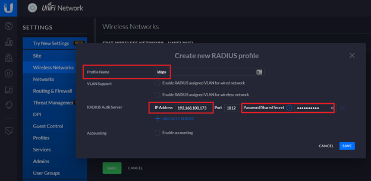
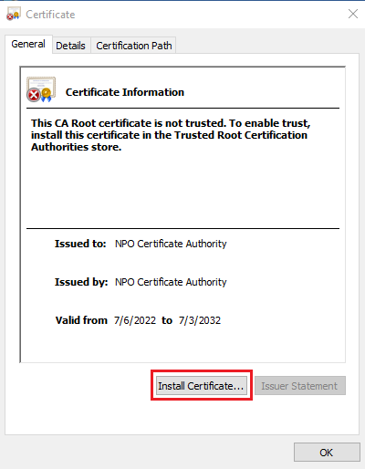
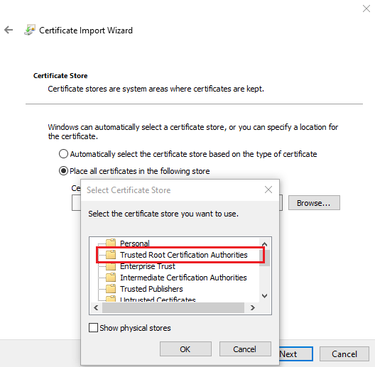
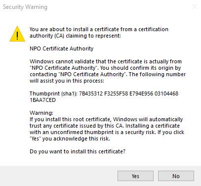
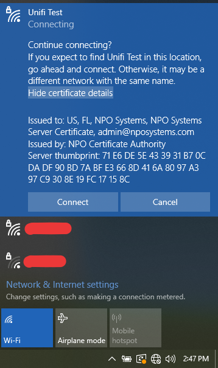
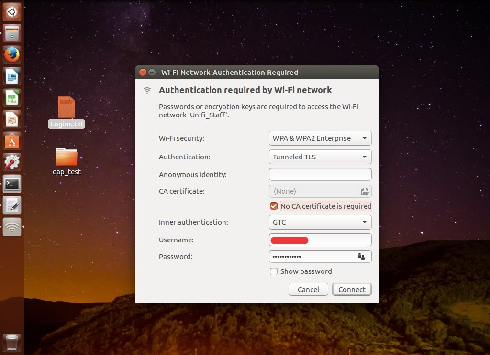

This post documents the process of integrating FreeRADIUS with Google G Suite (now Workspace) using Secure LDAP. FreeRADIUS will be used to authenticate Ubiquiti Unifi WPA2 Enterprise WiFi users. The configurations presented here are taken from [this](https://github.com/hacor/unifi-freeradius-ldap) wonderful repository. While the repo uses Docker, we will be implementing these settings in FreeRADIUS directly. These settings were tested on Debian 10.

<!--more-->

First, follow steps 1-3 given in Google’s support [article](https://support.google.com/a/topic/9173976) and also generate access credentials. At the end of these steps, you’ll have a certificate and key along with your access credentials.

Then, install FreeRADIUS and its required packages:

```
apt update && apt upgrade
apt -y install freeradius freeradius-ldap freeradius-utils
```

Upload the certificate and key files downloaded from Google G-Suite Admin account into the following directory:

```
/etc/freeradius/3.0/certs/
```

Rename those files to:

```
ldap-client.crt
ldap-client.key
```

Next, use a text editor like nano to edit */etc/freeradius/3.0/clients.conf*:

```
nano /etc/freeradius/3.0/clients.conf
```

Add the following lines at the end (replace *192.168.1.0/24* with your LAN subnet and *testing123* with a more secure secret):

```
client unifi {
       ipaddr          = 192.168.1.0/24
       secret          = testing123
}
```

Use Ctrl + X to save and exit.

Edit the *default* virtual server:

```
nano /etc/freeradius/3.0/sites-enabled/default
```

In *authorize* section after *pap* add this:

```
        if (User-Password) {
            update control {
                   Auth-Type := ldap
            }
        }
```

In *authenticate* section:

```
authenticate {
        Auth-Type PAP {
                ldap
        }
```

Uncomment *ldap*:

```
#       Auth-Type LDAP {
                ldap
#       }
```

Save and exit.

The same changes need to be done in */etc/freeradius/3.0/sites-enabled/inner-tunnel* to edit the *inner-tunnel* virtual server.

After that execute the following commands as *root* to enable *ldap* module:

```
cd /etc/freeradius/3.0/mods-enabled
ln -s ../mods-available/ldap ldap
```

Now, edit the *ldap* module:

```
nano /etc/freeradius/3.0/mods-enabled/ldap

server = 'ldaps://ldap.google.com'
port = 636
```

Enter your access credentials here:

```
identity = 'foo'
password = bar
```

Enter your domain here:

```
base_dn = 'dc=example,dc=com'
```

In *tls* section:

```
start_tls = no

certificate_file = /etc/freeradius/3.0/certs/ldap-client.crt
private_key_file = /etc/freeradius/3.0/certs/ldap-client.key

require_cert    = 'allow'
```

Save and exit.

Next, set up the *eap* module:

```
nano /etc/freeradius/3.0/mods-enabled/eap
```

In *eap* section:

```
default_eap_type = ttls
```

In *ttls* section:

```
default_eap_type = gtc
```

Save and exit. Finally, set the proxy settings:

```
nano /etc/freeradius/3.0/proxy.conf
```

Enter your domain at the end of the file:

```
realm example.com {

}
```

Save and exit.

Use the following command to restart FreeRADIUS service for new settings to take effect:

```
systemctl restart freeradius.service
```

FreeRADIUS settings are now complete. On the Unifi Controller, go to Settings -> Wireless Networks and either create a new wireless network or edit an existing network. In Security select WPA Enterprise:


It will require a RADIUS Profile to be specified. Click on “Create new RADIUS profile”. Enter a name for the profile and specify the IP address of your RADIUS server and its shared secret (created earlier).



Save the changes made to RADIUS profile and Wireless network.

To setup a mobile client to connect to this network enter your G-Suite Username and password like this:


Note: Users are free to enter only their User ID or complete email address in *\<UserID>@example.com* format. It should work either way.

In case of an error, make sure the EAP method is *TTLS*. For Phase 2 or inner tunnel use either *GTC* or *None*. Some devices will auto-detect these settings but on some devices you might need to select them manually.

### Generating Certificates for Windows Clients

For authenticating Windows clients we need to generate CA and server certificates on FreeRADIUS and install them on client machines. FreeRADIUS provides helpful scripts for generating certificates.

To generate a self-signed CA certificate (which is what is recommended for RADIUS deployments), open the CA configuration file:

```
nano /etc/freeradius/3.0/certs/ca.cnf
```

In *CA_default* section increase the number of days so that the certificate will be valid for a long time (10 years in this case):

```
default_days            = 3650
```

In *req* section change the *input_password* and *output_password* from their default values:

```
input_password          = tj367tHXVK
output_password         = tj367tHXVK
```

In *certificate_authority* section enter your organization’s information:

```
countryName             = US
stateOrProvinceName     = FL
localityName            = Miami
organizationName        = NPO Systems
emailAddress            = admin@nposystems.com
commonName              = "NPO Certificate Authority"
```

Save and exit.

Run the following commands to generate CA certificates:

```
make ca.pem
make ca.der
```

Next generate server certificate by following the same procedure:

```
nano /etc/freeradius/3.0/certs/server.cnf
```

Change *default_days* to a large value, *input_password* and *output_password* from their default values and enter your organization’s information in *server* section. Make sure the *commonName* entered here is different from the one entered in *ca.cnf*:

```
default_days            = 3650

input_password          = tj367tHXVK
output_password         = tj367tHXVK

[server]
countryName             = US
stateOrProvinceName     = FL
localityName            = Miami
organizationName        = NPO Systems
emailAddress            = admin@nposystems.com
commonName              = "NPO Systems Server Certificate"
```

Save and exit.

Generate server certificate by running this command:

```
make server.pem
```

Ensure generated files have the right ownership:

```
chown freerad:freerad /etc/freeradius/3.0/certs/*
```

Add the paths of newly generated certificates in *eap* configuration file:

```
nano /etc/freeradius/3.0/mods-enabled/eap
```

In *tls-config tls-common* section add the following values:

```
private_key_password = tj367tHXVK
private_key_file = /etc/freeradius/3.0/certs/server.pem
certificate_file = /etc/freeradius/3.0/certs/server.pem
ca_file = /etc/freeradius/3.0/certs/ca.pem
```

Save and exit.

Restart FreeRADIUS service:

```
systemctl restart freeradius
```

### Installing Certificates on Client Machines

#### WINDOWS

Download *ca.pem* and *ca.der* certificates from */etc/freeradius/3.0/certs/* and distribute to your clients. On a Windows client, *ca.der* certificate can be installed by double-clicking on it and following the installation wizard:



Place the certificate in *Trusted Root Certification Authorities* store:



After completing the wizard, accept the security warning:



Connect to the WiFi by entering your username and password. If it shows you the certificate information click on Connect to continue:



#### UBUNTU

The CA certificate in *pem* format needs to be converted to *crt* format. It can be done by executing this command:

```
openssl x509 -outform der -in ca.pem -out ca.crt
```

Download *ca.crt* file and put it in */usr/local/share/ca-certificates/* directory on the client machine. Then, install the certificate:

```
sudo update-ca-certificates
```

Connect to WiFi by selecting Authentication *Tunneled TLS*, Inner authentication *GTC* and entering your username and password:



### Troubleshooting

In case of any issues troubleshoot FreeRADIUS by first stopping its service:

```
systemctl stop freeradius.service
```

After that start it in debug mode:

```
freeradius -X
```

Follow the debug output to troubleshoot further.

### References

[Unifi FreeRADIUS on Docker with Google Secure LDAP](https://github.com/hacor/unifi-freeradius-ldap)

[FreeRADIUS Production SSL Certificates](https://schoolsysadmin.blogspot.com/2016/03/freeradius-production-ssl-certificates.html?m=0)